# COVID-19 modelling results

## Models fitting comparision

| Model no. | Model 1 | Model 2 | Model 3 | Model 4 |
| -------- | -------- | -------- | ------- | ------- |
| formula     | as.integer(caserate) ~ 1 +  f(week, model = "rw2", constr = TRUE) +  f(new_id, model="bym2", graph = msoa.graph)     | as.integer(caserate) ~ 1 + weekly_mean_activity + f(week, model = "rw2", constr = TRUE) +  f(new_id, model="bym2", graph = msoa.graph)      |    as.integer(caserate) ~ 1+ weekly_mean_activity +     MobilityLag + f(week, model = "rw2", constr = TRUE) + f(new_id, model="bym2", graph = msoa.graph)  |as.integer(caserate) ~ 1+ weekly_mean_activity + MobilityLag +weekly_mean_activity_lag1 +weekly_mean_activity_lag2 +MobilityLag_weeklag_1 + MobilityLag_weeklag_2 +f(week, model = "rw2", constr = TRUE) + f(new_id, model="bym2", graph = msoa.graph) |
| WAIC | 1400435.92 | 1400562.41 | 1400029.36 | 1399839.40 |
| CPO     | -1122138     | -1122081   | -1121999 | -1121268 |
| -------- | -------- | -------- | ------- |  ------- |
| R2 | 0.73 | 0.73 | 0.73 | 0.73 |
| RMSE     | 84.15     | 84.15     |   84  | 84 |
| -------- | -------- | -------- | ------- | ------- |
| Precision for week | (2.45 to 5.9 ) | (2.44 to 5.89) |(2.4 to 5.86)| 2.54 to 6.1 |
| Precision for area    | (5.2 to 6.82) | (5.24 to 6.88) | (2.96 to 3.9)| 2.76 to 3.67 |
| Phi for area | (0.45 to 0.69) | (0.442 to 0.681) | (0.4 to 0.65) | 0.45 to 0.69 |
| -------- | -------- | -------- | ------- |  ------- |
| Intercept| (-6.66 to -6.64) | (-6.65 to -6.60) |(-6.78 to -6.72)| (-7.033 to -6.96) |
| Activity Within | XX | (-0.214 to -0.070) |(-0.8 to -0.64)| (-1.63 to -1.44) |
| Activity lagged by mobility | XX     | XX     |  (2.48 to 2.77) | (3.13 to 3.52) |
| Activity lagged by mobility and 1 week | XX     | XX     |  XX | (-1.27 to -0.88) |

## Residuals in models
### Model 1
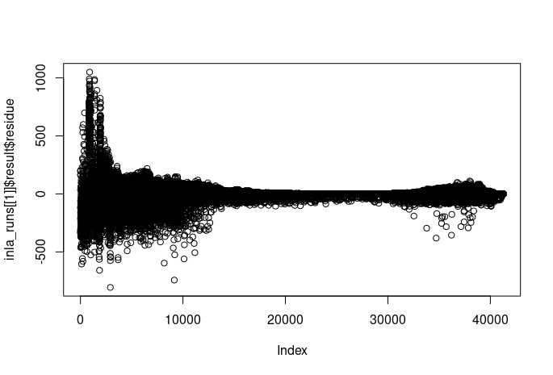

### Model 2
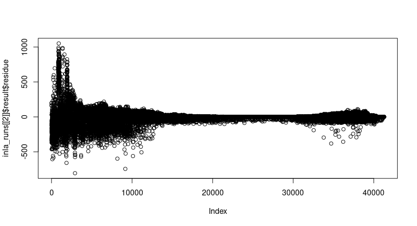

### Model 3

### Model 4

## Spatial Random effect plots
### Model 1
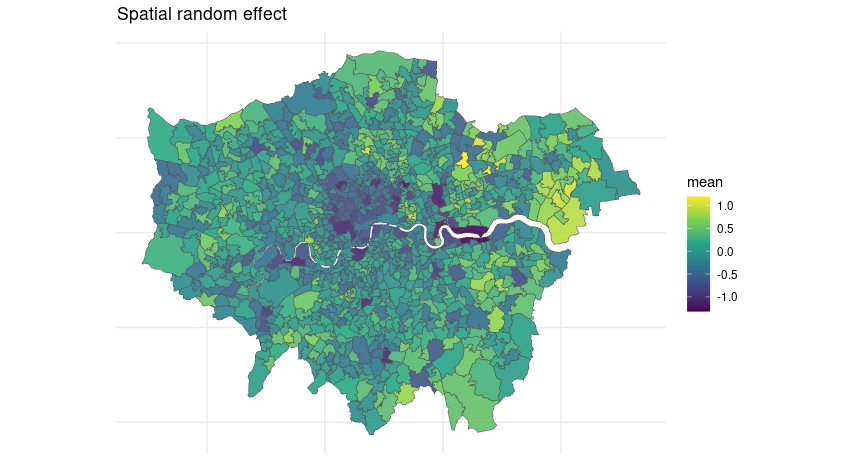

### Model 2
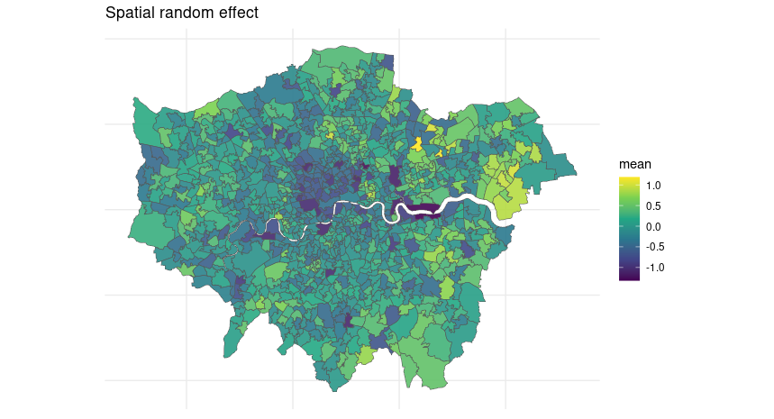

### Model 3
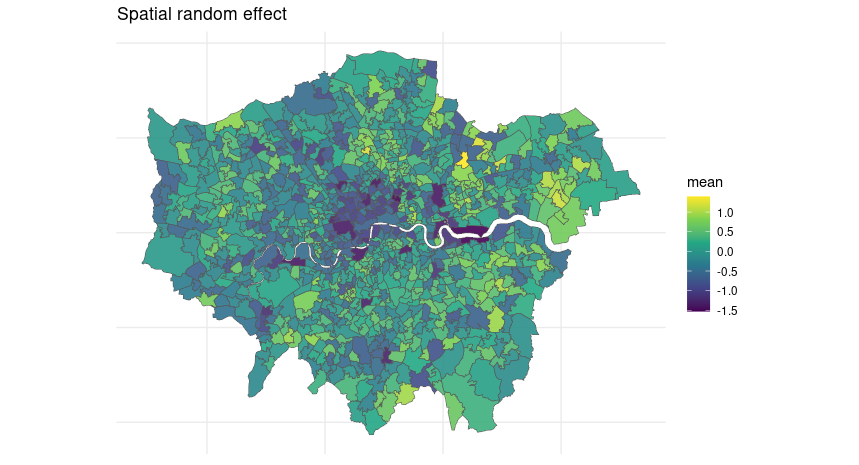

### Model 4
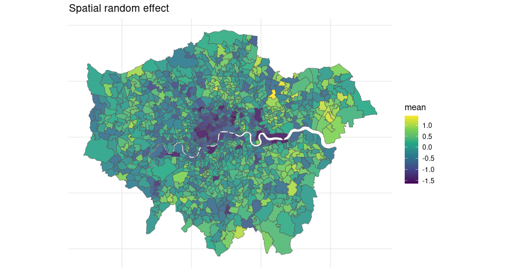

## Temporal Random effect plots 
### Model 1

### Model 2

### Model 3
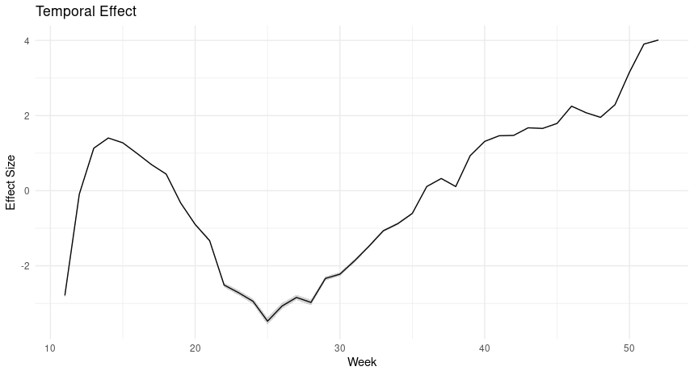

### Model 4

## Observed vs Fitted caserate
### Temporal plot of selected areas

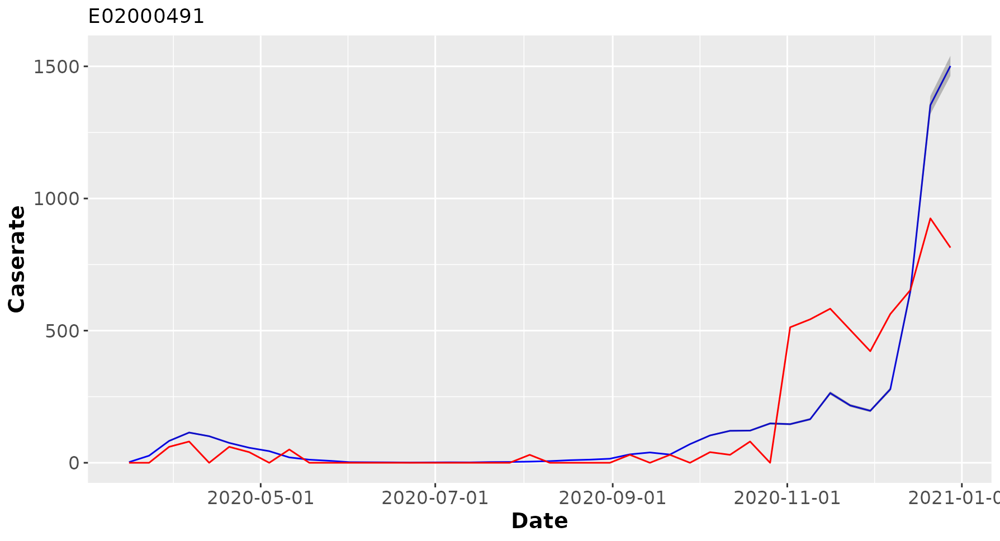

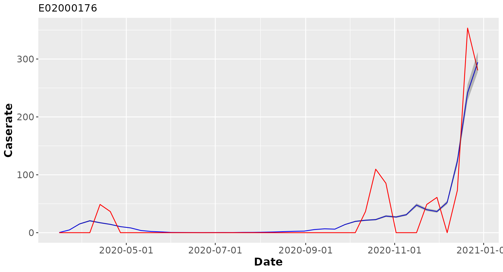

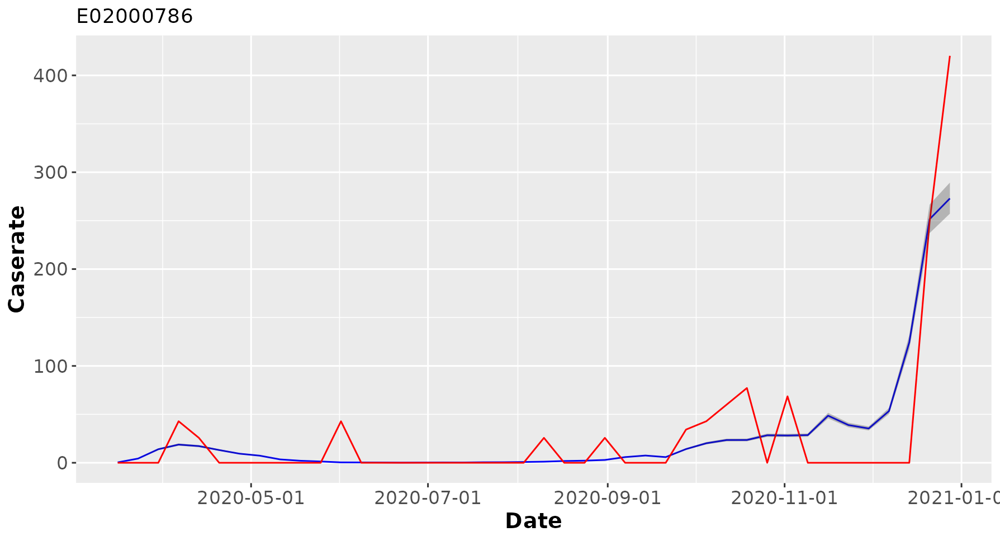

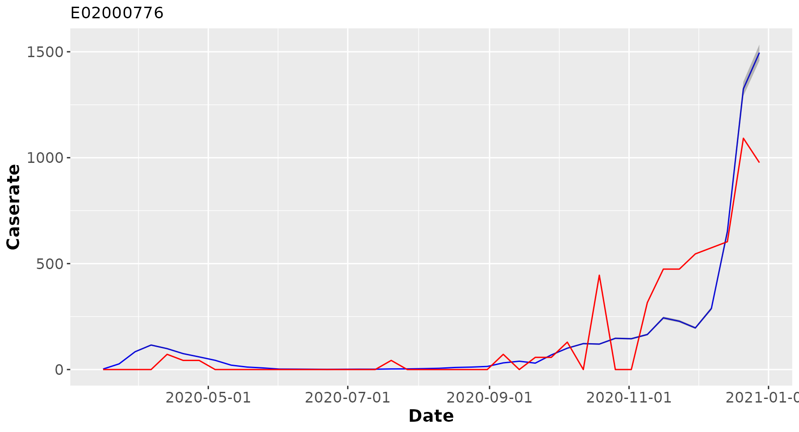

### Spatial plots for selected dates
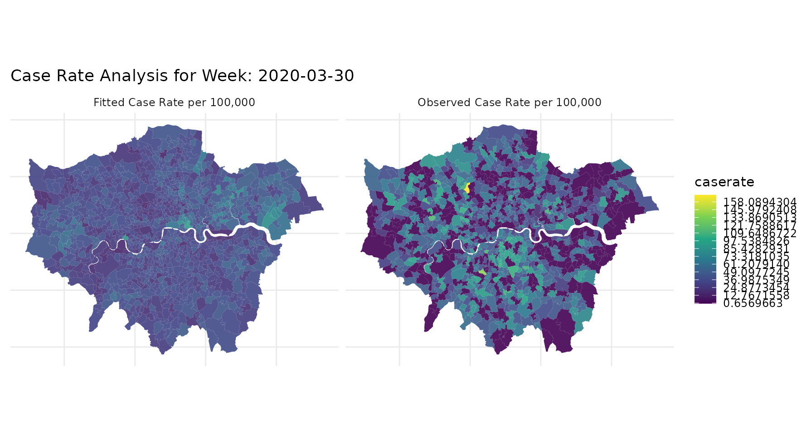

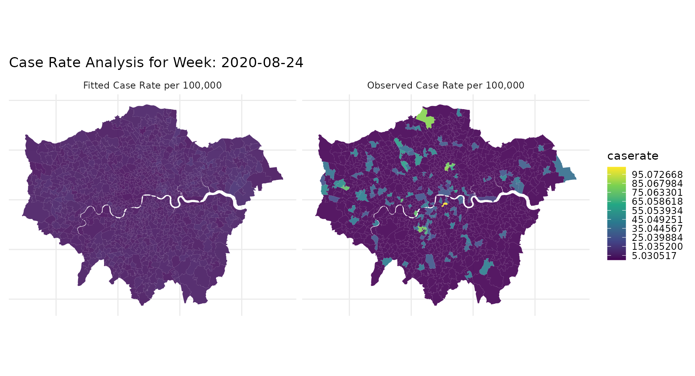

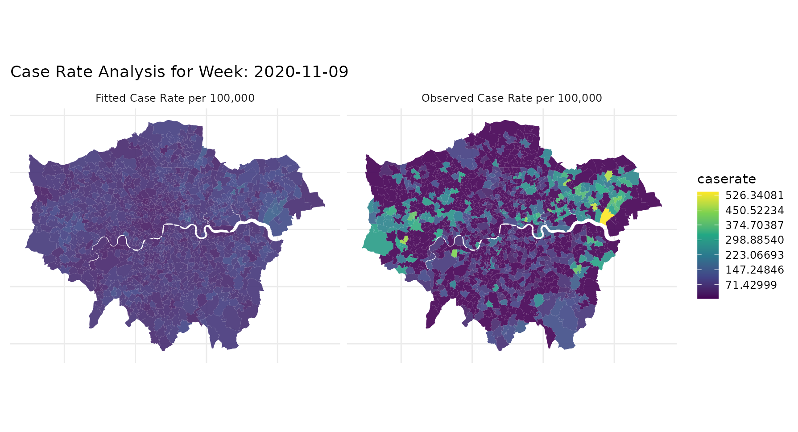

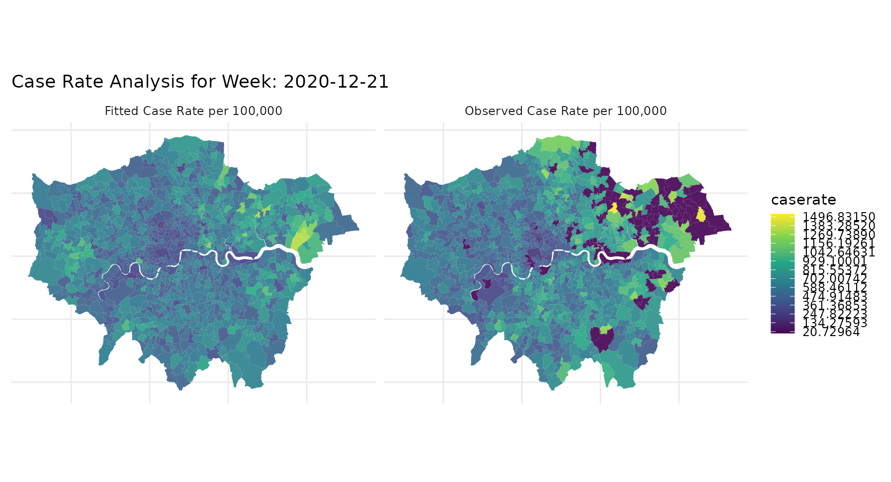